# Seksun CNC 目标架构

> 目标：建设以独立制造领域模型为核心、以工序库为执行能力、以工艺知识库为决策能力、以开源 CAD/CAM 内核为可替换计算引擎的专业 CAM 平台。

如果当前 Markdown 预览器不能显示 SVG，可直接打开 [`docs/target-architecture.svg`](docs/target-architecture.svg)；同时提供 [`docs/target-architecture.png`](docs/target-architecture.png) 位图版本，架构图源码位于 [`docs/target-architecture.mmd`](docs/target-architecture.mmd)。

## 架构原则

1. **制造领域模型独立**：项目、装夹、工序、刀具和刀路不能直接等同于 FreeCAD 对象。
2. **工序库与知识库分离**：工序库回答“怎么执行”，知识库回答“为什么选择以及如何排序”。
3. **引擎可替换**：FreeCAD、OCCT、CAMotics、OpenCAMLib 等通过 Provider/Adapter 接入。
4. **刀路中间格式统一**：显示、仿真、碰撞、时间估算和后处理共用 Toolpath IR，不从动画反推加工语义。
5. **重计算可追溯**：几何、工艺方案、刀路、仿真和 NC 文件都有不可变版本与完整生成记录。
6. **高风险结果必须审核**：自动规划只产生可解释的候选路线，未经验证和批准不得直接上机。

## 当前到目标的实施顺序

- **阶段一：人工 CAM 闭环**——完善 2D/2.5D 工序库、稳定 B-Rep 选择、装夹/坐标系/毛坯、真实 FreeCAD 刀路。
- **阶段二：验证闭环**——统一 Toolpath IR、材料去除、刀具/刀柄/夹具碰撞、过切欠切和后处理验证。
- **阶段三：半自动规划**——特征到工序规则、路线模板、刀具与参数推荐、决策解释。
- **阶段四：企业知识闭环**——历史案例、人工修订、现场加工结果和机床约束持续回流。

## 建议部署形态

现阶段采用“模块化单体 API + 隔离 Worker”，不要过早拆成大量微服务。单机通过 Docker Compose 运行；任务量增加后，仅横向扩展 Geometry、CAM、Simulation 和 Post Worker。
