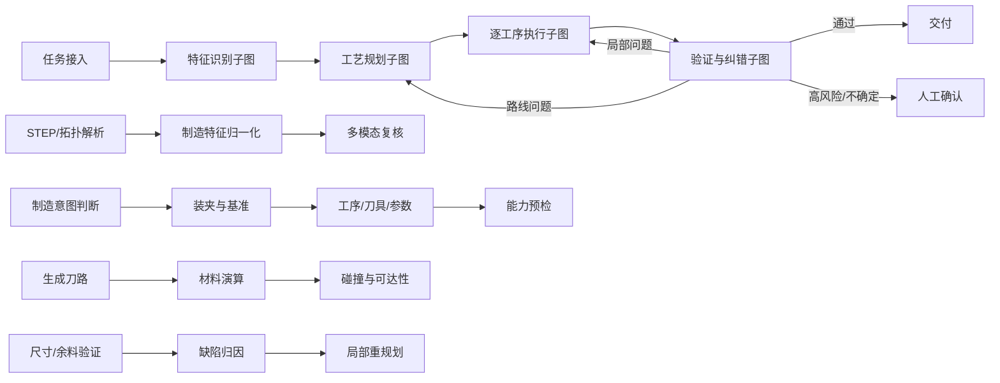

# CNC 智能体工作台 v1

## 目标

把一次工艺规划从“黑盒接口调用”改造成可恢复、可审计、可交互的智能体任务。界面展示决策摘要、证据、工具输入输出和产物，不展示或伪造模型的私有思维链。

## 主图与子图

LangGraph 的顶层图只负责路由、检查点、重试预算和人工中断；几何识别、工艺规划、逐工序加工、验证纠错分别作为子图，避免一个超大 Agent 同时承担所有职责。

## 节点约定

每个节点必须输出统一事件：

- `subgraph`、`node_id`：节点身份；
- `status`：`running/completed/failed/blocked/waiting`；
- `summary`：给用户看的决策摘要；
- `evidence`：几何、规则、设备能力或仿真指标；
- `artifacts`：模型、分析 JSON、方案、刀路、验证报告；
- `viewer`：右侧模型视图指令，可定位模型、特征或工序；
- `sequence/event_id`：支持回放与检查点恢复。

## 工具边界

| 工具组 | 作用 | 是否允许 AI 自由决定结果 |
|---|---|---|
| 几何工具 | STEP 解析、拓扑与尺寸、特征候选 | 否，AI 只能解释和复核 |
| 规划工具 | 确定性草案、装夹、刀具与参数候选 | AI 可提出建议，编译器负责落地 |
| CAM 工具 | 刀路生成、材料移除、设备运动学 | 否，必须由确定性引擎执行 |
| 验证工具 | 碰撞、过切/欠切、可达性、覆盖率 | 否，结果作为门禁 |
| 纠错工具 | 缺陷归因、局部重规划、回退 | AI 选择策略，受重试预算约束 |
| 人工工具 | 确认材料、设备配置、基准和高风险决策 | 必须显式确认后继续 |

## 当前落地范围

v1 已完成智能体事件协议、任务工作区接口、实时执行过程、数据文件浏览和右侧三维视图联动。

v2 已将工艺规划迁入真实 LangGraph 子图：

1. `review_ai`：调用 Qwen 输出结构化制造意图、风险和工序建议；
2. `synthesize_candidate`：使用确定性编译器生成隔离候选方案；
3. `validate_candidate`：重新计算特征覆盖率；
4. `decide_promotion`：比较正式基线与候选方案，并执行风险、覆盖率、能力和人工复核门禁。

每次运行都会保存 `planning-guidance.json`、`agent-plan.json` 和 `agent-evaluation.json`。当前默认为 `shadow`，所以候选方案不会改变 `plan.json`；只有明确切换到 `active` 且候选方案通过全部门禁，才允许晋级。

v3 已将 CAM 之后的真实执行证据接入逐工序 LangGraph 子图：

1. `select_operation`：按装夹与工序顺序选取当前工序；
2. `inspect_toolpath`：检查确定性 CAM 实际生成的刀路与切削段；
3. `inspect_simulation`：关联材料移除仿真的累计体积证据；
4. `verify_operation`：合并缺陷、碰撞和纠错建议，为每道工序生成可审计记录；
5. `summarize_execution`：通过门禁选择交付、局部纠错、工程复核或人工复核。

子图不替代 CAM、材料仿真和碰撞引擎，只负责调度和判断这些工具的真实输出。结果保存为 `agent-execution.json`，前端在 CAM 或自动纠错结束后会自动刷新智能体轨迹和数据文件。

v4 已将局部重试调度迁入验证纠错 LangGraph 子图：

1. `attribute_defect`：汇总缺陷级别、关联工序、装夹和全局缺陷；
2. `choose_repair_scope`：确定工序级、装夹级或全局修正范围，并执行重试预算门禁；
3. `replan_local`：只调用被确定性分析器标记为 `auto_applicable` 的安全修正；
4. `regenerate_and_validate`：重新生成真实刀路、材料仿真、空间一致性与碰撞结果；
5. `assess_revalidation`：根据新报告继续局部迭代，或转入放行、人工复核和重试预算耗尽状态；
6. `finalize_remediation`：归档每轮修正及最终门禁，生成 `agent-remediation.json`。

该子图不会让 AI 任意改动工艺参数；实际修改仍由原有确定性纠错器执行，高风险缺陷和无安全动作的问题直接停止并转人工复核。

## 迁移顺序

1. 事件与产物协议（已完成）。
2. 工艺规划子图在 shadow 模式并行运行，比较现有方案与智能体方案（已完成）。
3. 逐工序执行采用“规划 → 仿真 → 验证 → 局部修正”循环（已完成）。
4. 建立基准零件集与通过门槛，再将 `CNC_AGENT_MODE` 切换为 `active`。
5. 最后引入独立的多模态特征识别子图，保留几何内核作为事实来源与校验器。
