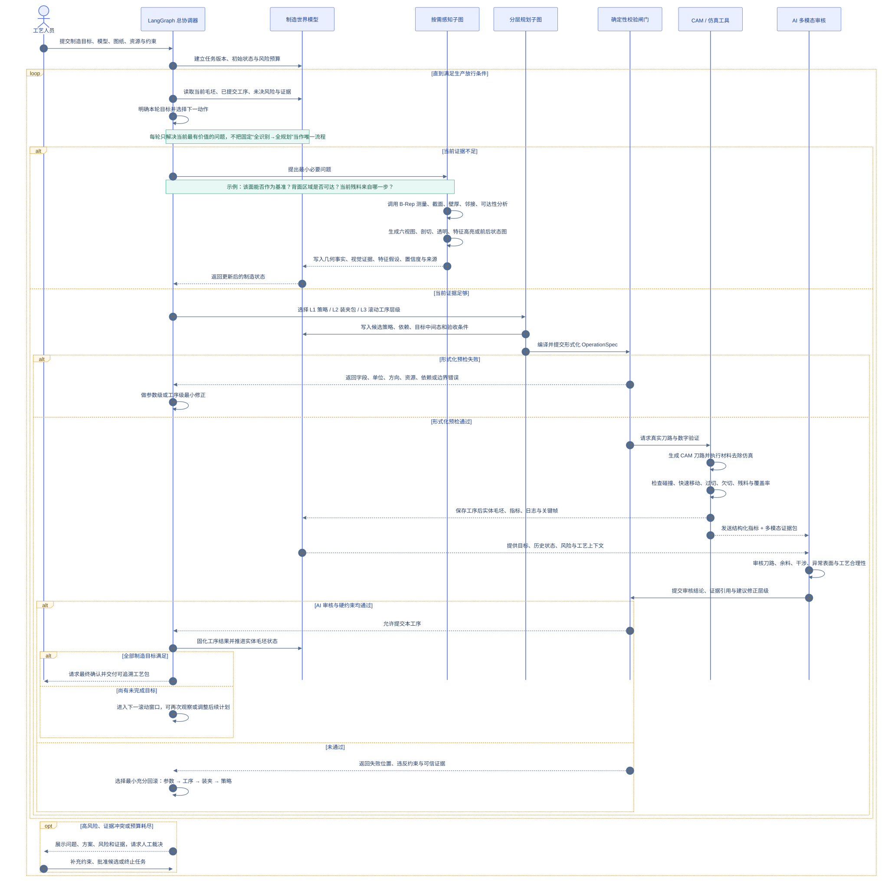

# CNC 工艺智能体目标架构

这份架构将系统定义为“可观察、可调用工具、可验证、可回滚的制造决策系统”，而不是把大模型包装成一次性工艺方案生成器。

## 总体架构

## 单次滚动规划与仿真闭环

## 关键设计结论

1. **按需感知，而非固定前置识别**：初始观察只建立全局认识和问题清单；规划、仿真和审核阶段均可再次调用几何分析与多模态观察工具。
2. **分层规划，而非两个极端**：先形成可调整的制造策略，再形成装夹工作包，最后滚动细化当前和少量后续工序。已经仿真通过的工序提交为事实，后续计划仍可重排。
3. **AI 与确定性计算明确分工**：AI 负责提出问题、理解语义、制定策略、生成候选和诊断失败；几何事实、刀路、仿真、碰撞、公差与安全闸门由确定性工具负责。
4. **仿真结果必须回到 AI**：提供结构化指标、关键视图、前后实体和失败位置组成的证据包，不能只给 AI 一句“成功/失败”。
5. **制造世界模型是核心状态**：所有节点读取并更新同一份带来源、置信度和版本的状态，避免“页面展示一套、规划使用另一套、仿真又使用第三套”。
6. **失败按层级回滚**：优先做参数级修正；证据表明问题更深时，才依次回滚工序、装夹和制造策略，避免每次失败都推翻全部规划。
7. **以生产放行为终点**：只有目标覆盖、真实刀路、仿真和安全检查、关键公差、风险处置及证据追溯全部满足，计划才可进入生产。

## 建议的状态确认等级

| 等级 | 含义 | 是否可直接驱动生产 |
|---|---|---|
| 假设 | AI 根据视图或上下文提出的候选判断 | 否 |
| 观察确认 | 多视图或剖切图支持该判断 | 否 |
| 几何确认 | 精确拓扑、尺寸或关系查询确认 | 可用于规划 |
| 工艺确认 | 资源、方向、装夹与参数约束均成立 | 可生成刀路 |
| 仿真确认 | 真实刀路通过材料去除、碰撞和符合性检查 | 可提交，仍受审批策略约束 |

## 前端交互映射

- 左侧不是一次铺开全部“思考节点”，而是按当前目标折叠显示：**正在解决什么 → 为什么调用某工具 → 得到了什么证据 → 决定了什么 → 是否需要修正**。
- 右侧始终作为证据工作区，按节点切换原模型、特征高亮、剖切、刀路、仿真前后实体、碰撞位置或偏差热图。
- 用户看到的是可解释的决策摘要和证据，不展示冗长的模型内部思维文本。
- 计划中的工序与已仿真提交的工序必须有明显状态差异，避免把候选计划误认为已验证结果。

