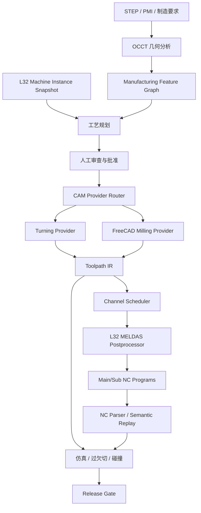

# Citizen Cincom L32 CAM 适配开发方案

> 文档版本：0.2  
> 日期：2026-09-15  
> 状态：P2 原型开发中  
> 设备资料：`C:\Users\wanghang\Desktop\L32(1).pdf`（Catalog No. 446，2016-05）

## 0. 实施进度

截至 2026-09-15：

- P0 基础已完成：版本化 L32 定义、四变体轴能力、刀具模块、设备实例校验、配置快照哈希及实例 API。
- P1 基础已完成：回转轴候选、基于可视边投影的阶梯/锥面 `Z-R` 外轮廓、圆柱回退轮廓、10 类实验级车削工序和候选车削刀具。
- P2 原型已形成安全闭环：Toolpath IR v1、10 类单主轴车削 Provider、二维 `Z-R` 刀具中心线余料仿真，以及绑定 L32 配置快照的草案生成 API。
- 当前草案接口强制人工接受回转轮廓，校验棒料直径、装夹长度、机床能力与主轴/刀具转速，并固定返回 `DRAFT`、`nc_generated=false`。
- 前端已加入 L32 适配工作台，可配置设备实例、选择模块、持久化确认回转轮廓、编辑车削参数并查看 `Z-R` 草案仿真结果。
- 已加入目标轮廓验证，按外/内轮廓材料侧规则计算过切、残料、最大径向偏差和估算异常体积，并输出独立验证产物。
- 外圆/内孔精车已生成显式刀尖圆心补偿轨迹，`Z-R` 仿真会扫掠圆形刀尖；粗车和专用循环暂时保留中心线近似。
- 已加入二维刀具可达性门禁：检查刀具加工侧、方向元数据、隐藏倒扣、棒料包络，以及内孔镗杆入口、径向空间和轴向伸出长度。
- 精确 B-Rep 截面、刀片象限/刀杆可达性、机床运动学碰撞和完整工艺自动编译尚未完成。
- P3 MELDAS 后处理仍受现场编程手册、设备配置和黄金 NC 程序阻断。

当前所有车削能力保持 `experimental`，不会进入既有 FreeCAD 生产路径，也不会输出可上机程序。

## 1. 结论与实施决策

L32 适配具备开发可行性，但不能仅通过增加一个 FreeCAD 后处理器完成。项目应保留 OCCT 的几何能力、FreeCAD CAM 的铣削能力和现有 API/工作台，在此基础上新增以下独立能力：

1. 模块化 L32 机床配置与现场设备实例。
2. 回转特征识别和车削工艺规划。
3. 确定性的二维车削刀路 Provider。
4. 统一 Toolpath IR 和双通道调度模型。
5. Citizen/MELDAS 专用后处理器及 NC 回读验证。
6. 车削余料、机床运动学和碰撞验证。

实施采用“单机型单主轴闭环优先，随后扩展副主轴和动力刀具”的策略：

- 首个可交付版本只绑定一台确认配置的 L32。
- 第一阶段只支持端面、外圆、内孔、槽、螺纹、轴向钻孔和切断。
- B 轴第一版只支持定位加工，不支持连续联动。
- 后处理器未经现场认证时只能输出 `DRAFT`，不得标记为生产程序。
- VIII、IX、X、XII 通过基础机型与可选模块组合表达，不复制四套业务逻辑。

## 2. 范围

### 2.1 最终目标

在明确的 L32 设备实例、控制器版本和刀具布局下，系统能够：

- 从 STEP 模型提取可审查的回转及复合加工特征。
- 生成正面、背面及动力刀具工艺计划。
- 生成可追溯的车削和钻铣 Toolpath IR。
- 编排主、副通道和同步节点。
- 输出目标 MELDAS/Citizen 方言 NC 程序。
- 对输出 NC 做回读、模态、超程、过切、欠切及碰撞验证。
- 经过空运行、试切和首件检验后，对限定设备配置进行生产放行。

### 2.2 首个生产闭环范围

- 单一 L32 设备实例。
- 导套式或无导套式二选一，以现场常用模式为准。
- 单主轴顺序加工。
- 端面、外圆粗精车、内孔粗精车、切槽、车螺纹、轴向钻孔、切断。
- 二维 `Z-R` 余料仿真。
- 单通道 MELDAS NC 输出和回读验证。
- 人工批准、空运行、低倍率单段和首件检验门禁。

### 2.3 首版非目标

- B 轴连续联动。
- 主副轴并行节拍优化。
- 全自动刀具选择和现场刀具寿命闭环。
- 未经现场确认的通用 L32 后处理器。
- 使用 CAMotics 作为 L32 车削或多轴放行依据。
- 在同一版本中同时认证全部 VIII、IX、X、XII 配置。

## 3. 设备资料基线

产品样本确认了以下结构性信息：

| 项目 | 资料基线 | 设计影响 |
| --- | --- | --- |
| 机型 | VIII / IX / X / XII | 使用基础机型加模块能力模型 |
| 基础轴 | X1/Y1/Z1、X2/Z2 | 每根轴独立建模，不使用统一三维行程数组 |
| B 轴 | IX、XII | 配置能力，首版按定位轴处理 |
| Y2 轴 | X、XII | 配置能力，绑定背面刀具台 |
| 棒料 | 标准 Ø32，可选 Ø38 | 区分标准能力、选件和现场实际能力 |
| 加工长度 | 导套模式一次装夹最大约 320 mm | 不能作为 Z 轴行程直接使用 |
| 正/背面主轴 | 最高 8000 rpm | 分别建模主轴状态和约束 |
| 排刀旋转刀具 | 最高 6000 rpm，额定 4500 rpm | 独立动力主轴与额定工况 |
| 背面旋转刀具 | 最高 6000 rpm，额定 3000 rpm | 独立动力主轴与额定工况 |
| 模块 | U30B/U31B/U32B、U120B/U121B、U150B/U151B/U12B 等 | 刀位、轴和工序能力由模块组合派生 |
| 控制器 | CINCOM SYSTEM M70LPC-VU | 后处理器必须绑定控制器方言版本 |

样本是产品能力资料，不是编程手册。以下信息不得从样本推断：

- 各轴零点、正方向、软限位和安全位置。
- 直径/半径编程方式及正背面坐标转换。
- 主副通道程序结构和同步等待代码。
- 夹紧、松开、相位同步、接料、送料和切断 M 代码。
- 刀具号、几何偏置、磨损偏置和刀尖方向格式。
- 动力刀具、C 轴、B 轴模式切换指令。
- 现场 PLC 宏、棒料机和接料器接口。

## 4. 当前项目基线与差距

### 4.1 可复用能力

- OCCT STEP/B-Rep 解析、拓扑和圆柱特征分析。
- 规则式规划、人工审查和工序批准流程。
- FreeCAD CAM 1.1.1 隔离 Worker 与原生铣削工序。
- 现有二维/2.5D 钻孔、轮廓、型腔和曲面 Provider。
- 版本化工序库、任务产物、预检和前端三维工作台。
- API、测试框架及生成进度事件。

### 4.2 关键差距

| 领域 | 当前状态 | L32 所需状态 |
| --- | --- | --- |
| 机床模型 | `axes + travel_mm[3]` 摘要 | 轴、通道、主轴、模块、刀位、选件和实例快照 |
| 工序库 | 以铣削/钻孔为主 | 完整二维车削、接料、切断和复合加工工序 |
| 回转规划 | 只能形成参考路线 | 形成可执行 Operation 和明确的能力阻断 |
| CAM 后端 | FreeCAD Path | FreeCAD Milling + Turning Provider |
| 刀路格式 | 从 FreeCAD Command 提取预览线段 | 具有制造语义和模态的统一 Toolpath IR |
| 后处理 | FANUC/GRBL 二选一 | 版本化 Citizen L32 MELDAS 后处理 |
| 仿真 | 三轴高度场/CAMotics | `Z-R` 车削余料 + 三维复合去除 |
| 碰撞 | 刀具/刀柄圆柱与简化禁入盒 | 刀片、刀杆、刀台、导套、主副轴和运动链 |
| 放行 | 未配置后处理时 warning | L32 未认证条件必须 hard fail |

开发前应同步修正文档版本描述：运行镜像固定 FreeCAD 1.1.1，而 README 仍存在 FreeCAD Path 0.20.2 的旧说明。

## 5. 目标架构



核心约束：

- 领域对象不能依赖 FreeCAD 对象。
- 刀路生成和控制器输出必须分层。
- 后处理前 IR 与后处理后 NC 回读必须能够语义对比。
- 所有产物绑定不可变的零件、工艺、刀具、机床和后处理版本。

## 6. 领域模型设计

### 6.1 机床定义、实例和快照

```python
class MachineDefinition:
    id: str
    manufacturer: str
    family: str
    variants: list[str]
    supported_modules: list[MachineModuleDefinition]

class MachineInstance:
    id: str
    definition_id: str
    serial_number: str
    variant: str
    controller_revision: str
    operation_mode: Literal["guide_bushing", "guide_bushing_less"]
    installed_modules: list[str]
    axes: list[AxisConfiguration]
    spindles: list[SpindleConfiguration]
    channels: list[ChannelConfiguration]
    tooling_layout_id: str
    postprocessor_profile_id: str | None

class MachineSnapshot:
    instance_id: str
    revision: int
    configuration_hash: str
    captured_at: datetime
    configuration: MachineInstance
```

`MachineDefinition` 表达样本能力，`MachineInstance` 表达某台现场设备，`MachineSnapshot` 固化一次 NC 生成所依据的配置。

### 6.2 轴和模块

每根轴至少包含：

- 轴名、类型、方向向量、单位。
- 所属通道、所属刀台或主轴。
- 最小/最大位置、最大快速速度和最大加工进给。
- 是否为标准配置、选件或禁用。
- 回转轴角度范围、周期和定位/联动能力。

模块定义负责派生：

- 可用刀位数和刀位类型。
- 可用轴、主轴及加工侧。
- 允许的工序类型。
- 刀具直径、攻丝和转速限制。

### 6.3 回转加工特征

新增但不限于：

```text
RotationalDatum
OuterDiameterSegment
InnerDiameterSegment
FaceFeature
TaperFeature
RevolvedArcFeature
ODGroove / IDGroove / FaceGroove
ExternalThread / InternalThread
CutoffFeature
AxialHole / RadialHole / EccentricFeature
FrontSide / BackSide assignment
```

所有自动识别特征保留置信度、几何来源和人工审查状态。

### 6.4 工序模型

第一阶段工序：

```text
turn_facing
turn_od_roughing
turn_od_finishing
turn_id_roughing
turn_id_finishing
turn_grooving
turn_threading
axial_drilling
axial_tapping
turn_cutoff
```

第二阶段工序：

```text
sub_spindle_pickoff
back_turning
c_axis_index
radial_drilling
cross_tapping
end_face_milling
cross_milling
b_axis_indexed_drilling
b_axis_indexed_milling
```

车削工序参数需覆盖：

- 恒线速/定转速、最高转速和主轴方向。
- 每转进给/每分钟进给。
- 粗加工切深、退刀量、精加工余量和光刀。
- 刀片形状、刀尖半径、刀尖方向和刀杆姿态。
- 螺纹牙型、螺距、切入方式及多刀参数。
- 槽刀/切断刀宽度和中心位置。
- 主轴、通道、刀位和加工侧。

## 7. Toolpath IR

### 7.1 文件级结构

```json
{
  "schema_version": "1.0.0",
  "units": "mm",
  "coordinate_convention": "diameter-x_z",
  "machine_snapshot_hash": "...",
  "plan_revision": 1,
  "channels": [],
  "traceability": {}
}
```

### 7.2 指令集

运动指令：

- `rapid_move`
- `feed_move`
- `arc_move`
- `dwell`

状态指令：

- `select_tool`
- `set_geometry_offset`
- `set_wear_offset`
- `set_rpm`
- `set_constant_surface_speed`
- `set_feed_per_revolution`
- `set_feed_per_minute`
- `spindle_start/stop/orient`
- `coolant_on/off`

走心机指令：

- `chuck_open/close`
- `guide_bushing_mode`
- `bar_feed`
- `sub_spindle_approach`
- `spindle_phase_sync`
- `pickoff`
- `cutoff`
- `channel_wait`
- `sync_barrier`
- `part_eject`

每条指令必须包含 `operation_id`、`channel_id`、来源工序和安全前置条件。后处理器不得根据坐标猜测接料、切断或同步语义。

## 8. CAM Provider 设计

### 8.1 Provider 接口

```python
class CamProvider(Protocol):
    def supports(self, operation, machine) -> SupportResult: ...
    def generate(self, context, operation) -> ToolpathProgram: ...
```

`SupportResult` 必须区分：

- `supported`
- `conditional`
- `unsupported`
- `configuration_missing`
- `experimental`

### 8.2 Turning Provider

首版采用确定性二维 `Z-R` 算法：

1. 将目标回转外形投影为有向轮廓。
2. 根据刀片、刀尖半径和刀杆姿态求可达区域。
3. 生成粗车分层路径和安全退刀。
4. 生成刀尖半径补偿后的精车路径。
5. 对槽、螺纹和切断使用专用策略。
6. 对路径做自交、残留、过切和安全退刀检查。
7. 输出 Toolpath IR，不直接输出 G-code。

### 8.3 FreeCAD Milling Provider

保留当前 FreeCAD 1.1.1 Provider，用于：

- 轴向/径向钻孔。
- 端面和侧面轮廓铣削。
- 槽和小型型腔。
- 雕刻。

接入 L32 时增加坐标映射层，不允许直接把 FreeCAD 的 XYZ 命令作为机床轴命令。首版只支持 C/B 定位后的 2.5D 加工；连续联动单独立项。

## 9. 多通道调度

工艺计划先建立依赖图，再生成通道时间线：

```text
装料 → 正面车削 → 接料准备 → 主副轴同步 → 切断
                                  ├→ 背面加工
                                  └→ 主轴侧下一根送料（后续优化）
```

调度器职责：

- 检查每个工序需要的主轴、轴、刀台和通道资源。
- 禁止资源重叠和不可达模块组合。
- 插入成对同步屏障。
- 验证所有同步点可到达，避免通道死锁。
- 第一版只生成顺序调度；并行节拍优化在现场闭环后启用。

## 10. L32 MELDAS 后处理器

### 10.1 分层

```text
Toolpath IR
  → Controller-neutral modal reducer
  → Citizen L32 dialect mapper
  → Machine-instance macro mapper
  → NC formatter
  → NC parser / semantic replay
```

后处理器配置必须版本化，并至少包含：

- 程序头尾和安全启动块。
- 单位、平面、绝对/增量、直径/半径模式。
- 主轴、动力刀具、C/B 轴模式。
- 刀具和偏置格式。
- 冷却、夹头、导套、棒料机和接料器指令。
- 主副通道及同步代码。
- 圆弧、螺纹、钻孔和切槽循环能力。

### 10.2 NC 回读验证

生成后的 NC 必须重新解析并验证：

- 未知或未批准 G/M 代码。
- 模态状态未初始化或泄漏。
- 坐标、进给、转速和主轴归属。
- 刀具和偏置一致性。
- 通道同步点成对性及可达性。
- 回读运动与 Toolpath IR 的几何/语义一致性。

生产级程序禁止使用当前“未配置即回退 GRBL”的逻辑。

## 11. 仿真与验证

### 11.1 二维车削余料

首版将棒料表示为沿 Z 分段的半径场：

1. 由棒料直径初始化 `radius[z]`。
2. 使用刀尖圆弧和刀杆姿态扫掠刀路。
3. 更新剩余半径并计算去除体积。
4. 与目标回转轮廓比较过切、欠切和余量。
5. 旋转半径场生成 Web 三维预览网格。

### 11.2 复合材料去除

- 先执行车削半径场去除。
- 将回转结果转换为三维网格或体素。
- 再叠加 FreeCAD 动力刀具路径。
- CAMotics 只保留为非车削三轴辅助结果，不作为 L32 放行证据。

### 11.3 运动学与碰撞

分级实现：

- V1：刀尖、刀片、刀杆与目标/棒料的二维检查。
- V2：刀具组件、导套、主轴和副主轴的三维静态包络。
- V3：各轴随时间运动的离散碰撞检测。
- V4：双通道同步过程和换料/接料状态验证。

## 12. API 与产物

建议新增或扩展：

```text
GET  /api/v1/machines/l32/definitions
POST /api/v1/machines/l32/instances
GET  /api/v1/machines/l32/instances/{id}
POST /api/v1/jobs/{id}/turning/analyze
POST /api/v1/jobs/{id}/turning/draft
POST /api/v1/jobs/{id}/cam
GET  /api/v1/jobs/{id}/release-status
POST /api/v1/jobs/{id}/release-transition
```

每次生成至少保存：

```text
machine-snapshot.json
rotational-features.json
process-plan.json
toolpath-ir.json
channel-schedule.json
program-main.nc
program-sub.nc              # 有副通道时
nc-replay.json
turning-simulation.json
collision.json
verification.json
release-record.json
```

当前 P2 原型实际保存 `turning-toolpath-ir.json`、`turning-simulation.json`、`turning-verification.json`、`turning-reachability.json` 和
`turning-draft.json`。这些产物只用于工程审查，不创建 `program.nc`；生产 NC 文件名及
下载入口必须等 P3 后处理器认证和放行状态机接入后再启用。

旧接口应保持兼容，通过 `process_kind`、Provider 和能力协商路由，不在前端硬编码设备 ID。

## 13. 前端设计

### 13.1 设备配置

- 选择设备实例而不是只选择产品名称。
- 展示变体、导套模式、已安装模块、可用轴和刀位。
- 未确认项以阻断项展示。

### 13.2 工序工作台

- 回转特征和 `Z-R` 轮廓视图。
- 正面/背面工序树。
- 工序、刀具、通道、主轴和刀位编辑。
- 主副通道时间线及同步节点。
- 每道工序的 Provider、成熟度和阻断原因。

### 13.3 验证与放行

- Toolpath IR 与 NC 回读差异。
- 过切、欠切、超程、碰撞和未知代码。
- 当前设备快照和后处理器认证版本。
- 放行阶段、审批人、时间和首件报告。

避免继续添加 `device.id === "citizen-cincom-l32"` 一类分支，界面应依据后端 capability schema 渲染。

## 14. 安全与放行状态机

```text
DRAFT
  → OFFLINE_VERIFIED
  → DRY_RUN_APPROVED
  → TRIAL_CUT_APPROVED
  → PRODUCTION_RELEASED
```

以下情况必须 hard fail：

- 设备变体、导套模式或关键模块未确认。
- 工序依赖未安装轴、刀台或动力主轴。
- 后处理器未绑定或未认证。
- Toolpath IR 与 NC 回读不一致。
- 主副通道同步不成对或存在死锁。
- 未知 G/M 代码、超程、超速、过切或碰撞。
- 生成时配置与当前机床实例配置哈希不一致。

“生成成功”不等于“可上机”；只有 `PRODUCTION_RELEASED` 可以显示生产程序下载入口。

## 15. 测试策略

### 15.1 单元测试

- 机型与模块能力派生。
- 回转轮廓提取和方向归一化。
- 刀尖补偿、粗车分层和安全退刀。
- 恒线速、转速上限和每转进给。
- 调度资源冲突和同步死锁。
- 后处理模态状态及 NC 解析。

### 15.2 属性与边界测试

- 刀路不得进入目标轮廓。
- 粗加工余量不得小于设定值。
- 所有快速移动满足安全前置条件。
- 生成 NC 中不存在未初始化的进给、主轴或坐标模式。
- IR → NC → Replay 的路径误差不超过配置公差。

### 15.3 黄金样例

每个已认证工序至少准备：

- 最小几何样件。
- 边界尺寸样件。
- 现场已验证 NC 黄金文件。
- 预期余料和关键坐标快照。
- 非法配置和预期阻断结果。

### 15.4 现场验证

1. 离线审查程序。
2. 无棒料空运行。
3. 单段、低倍率和提高安全间隙运行。
4. 软材料试切。
5. 首件全尺寸检验。
6. 固化机床快照、程序、测量结果和审批记录。

## 16. 分阶段计划

| 阶段 | 主要工作 | 交付物 | 退出条件 |
| --- | --- | --- | --- |
| P0 配置基线 | 设备定义/实例/快照、现场资料清单 | L32 配置 API 和校验 | 一台真实设备配置确认 |
| P1 回转领域 | 特征模型、识别、工序与规划 | 可审查车削方案 | 黄金 STEP 特征覆盖通过 |
| P2 单主轴 CAM | Turning Provider、Toolpath IR、预览 | 单主轴车削路径 | 几何、余量和安全退刀测试通过 |
| P3 后处理闭环 | MELDAS Post、NC Parser、Replay | `program-main.nc` 草案 | IR/NC 语义一致，现场专家批准格式 |
| P4 验证闭环 | Z-R 余料、过欠切、基础碰撞 | 验证报告 | 空运行和首件试切通过 |
| P5 副主轴 | 接料、切断、背面工序、双通道调度 | 主/副程序 | 同步死锁、碰撞和背面首件通过 |
| P6 动力刀具 | C/Y 定位钻铣、FreeCAD Provider 复用 | 车铣复合程序 | 复合样件通过 |
| P7 高级模块 | B 定位、Y2、模块化四机型 | IX/X/XII 扩展 | 每个配置独立认证 |

## 17. 工作包拆分

### Epic L32-0：设备配置

- L32-001：拆分通用 `MachineProfile` 与详细 `MachineInstance`。
- L32-002：录入四机型和刀具模块能力。
- L32-003：增加配置一致性和缺失资料校验。
- L32-004：实现配置快照与哈希。

### Epic L32-1：回转识别与规划

- L32-101：主回转轴候选和人工确认。
- L32-102：外/内 `Z-R` 轮廓提取。
- L32-103：端面、阶梯、槽、锥面、圆弧和切断特征。
- L32-104：螺纹和轴向孔输入模型。
- L32-105：车削工序定义和参数验证。
- L32-106：回转件工序规划与能力阻断。

### Epic L32-2：车削刀路

- L32-201：Toolpath IR schema、序列化和版本迁移。
- L32-202：端面和外圆粗精车。
- L32-203：内孔粗精车。
- L32-204：切槽和切断。
- L32-205：车螺纹和轴向钻孔。
- L32-206：刀尖补偿、可达性和安全退刀。

### Epic L32-3：后处理和验证

- L32-301：MELDAS 方言配置。
- L32-302：单通道 L32 后处理器。
- L32-303：NC 词法、语法和模态解析器。
- L32-304：IR/NC 语义回放对比。
- L32-305：未知指令白名单和 release gate。

### Epic L32-4：仿真

- L32-401：二维半径场材料去除。
- L32-402：刀尖/刀片/刀杆几何。
- L32-403：过切、欠切和剩余体积。
- L32-404：回转结果三维预览网格。
- L32-405：导套、主轴和副主轴碰撞模型。

### Epic L32-5：复合和多通道

- L32-501：副主轴接料状态机。
- L32-502：双通道资源图和同步屏障。
- L32-503：正背面坐标变换。
- L32-504：C/Y 定位动力刀具加工。
- L32-505：B 定位与 Y2 模块能力。

## 18. 预计投入

在 2～3 名熟悉 Python/C++、CAM 和数控工艺的人员参与，并能获得现场工程师支持的前提下：

- P0～P2 单主轴刀路原型：约 6～10 人周。
- P3～P4 单主轴现场闭环：约 6～10 人周。
- P5 主副轴和双通道：约 8～14 人周。
- P6～P7 动力刀具和多型号认证：约 10～20 人周。

日历时间参考：

- 单主轴 MVP：2～3 个月。
- 主副轴加基础动力刀具：4～6 个月。
- 四型号模块化覆盖及现场认证：6～12 个月。

现场资料、试机窗口和量测反馈是关键路径，以上估算不包含等待现场资源的时间。

## 19. 风险与应对

| 风险 | 影响 | 应对 |
| --- | --- | --- |
| 产品样本代替编程手册 | 输出错误 NC | 后处理阶段设置资料硬门禁 |
| 四机型/模块组合爆炸 | 分支和测试失控 | 基础机型 + 模块 capability + 实例快照 |
| 过度依赖 FreeCAD 车削 | 核心能力受上游限制 | 自研确定性 Turning Provider |
| CAMotics 不支持车削/多轴 | 仿真产生错误信心 | 自研 Z-R 仿真及 OCCT 运动学碰撞 |
| 后处理与刀路耦合 | 难以验证和更换控制器 | Toolpath IR + Post + NC Replay 分层 |
| 双通道死锁 | 机床停机或危险动作 | 依赖图、成对屏障和状态机验证 |
| 现场配置漂移 | 已验证程序失效 | 配置哈希和放行记录绑定 |
| 前端硬编码设备 ID | 后续机型扩展困难 | capability-driven UI |

## 20. 开发启动条件

### 20.1 现在即可开始

- P0 设备领域模型和配置 API。
- P1 回转特征模型、识别框架和工序库。
- P2 Toolpath IR 和单主轴二维车削 Provider。
- Z-R 仿真原型和前端轮廓预览。

### 20.2 后处理器启动前必须获得

- 现场 L32 的具体型号、序列号和出厂年份。
- 控制器软件版本和 Citizen/MELDAS 编程手册。
- 导套模式和实际安装模块。
- 完整刀位、刀具、偏置和安全位置配置。
- 现场已验证的单主轴程序。

### 20.3 副主轴/复合能力启动前必须获得

- 接料、切断、相位同步和通道等待样例程序。
- 动力刀具、C/B/Y2 模式切换样例。
- 主副轴及刀台的可用三维模型或保守碰撞包络。
- 现场测试计划、负责人和可用试机窗口。

## 21. 第一迭代建议

第一迭代控制在两周，目标不是输出 NC，而是建立不会返工的基础：

1. 新增机床定义、实例、模块、轴、主轴和通道模型。
2. 将现有 L32 数据迁移为基础定义和四种变体 capability。
3. 增加设备配置 API、校验器和快照哈希。
4. 新增 Toolpath IR v1 schema，但暂不连接后处理器。
5. 新增回转特征数据结构和最小 `Z-R` 轮廓提取测试。
6. 前端改为 capability 驱动，移除新增 L32 功能对设备 ID 的硬编码依赖。

第一迭代完成标准：

- 四机型能力由同一基础定义派生。
- 不存在的 B/Y2/动力刀具组合会被后端拒绝。
- 同一设备配置可产生稳定、可复现的配置哈希。
- 一个简单阶梯轴 STEP 能输出可审查的回转轴和 `Z-R` 轮廓。
- 现有三轴铣削流程和测试保持兼容。

## 22. “全面支持 L32”的完成定义

只有满足以下条件，才能对一个指定 L32 设备配置声明“全面支持”：

- 设备实例、模块、刀位、控制器和后处理版本已确认并冻结。
- 范围内所有工序具有 `validated` 或 `production` 成熟度。
- 所有 NC 均可回读，且与 Toolpath IR 语义一致。
- 车削、动力刀具、主副轴运动和同步均完成仿真及碰撞验证。
- 黄金样例、边界样例和失败样例自动测试通过。
- 现场空运行、试切和首件检验通过。
- 生成记录绑定机床配置哈希和审批记录。
- 未认证配置不能复用该设备的生产放行状态。

对其他 L32 变体的支持必须重新进行能力差异评估和现场认证，不能仅因同属 L32 系列自动继承。
